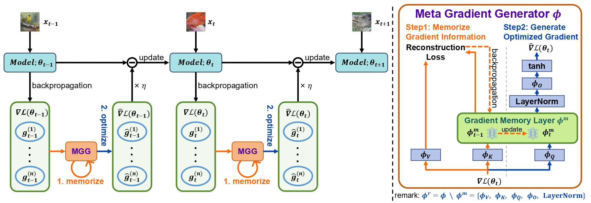

# Learning to Generate Gradients for Test-Time Adaptation via Test-Time Training Layers

This is the official project repository for Learning to Generate Gradients for [Test-Time Adaptation via Test-Time Training Layers by Qi Deng, Shuaicheng Niu, Ronghao Zhang, Yaofo Chen, Runhao Zeng, Jian Chen, Xiping Hu (AAAI 2025)](https://arxiv.org/pdf/2412.16901).

MGTTA conducts model learning at test time to adapt a pre-trained model to test data that has distributional shifts ☀️ 🌧 ❄️, such as corruptions, simulation-to-real discrepancies, and other differences between training and testing data.

* 1️⃣MGTTA devise a novel Meta Gradient Generator (MGG), which is automatically learned in a learning-to-optimize manner, to replace manually designed optimizers for TTA.

* 2️⃣MGTTA introduce a lightweight yet efficient sequential modeling network, which can memorize the historical gradient information during a longterm online TTA process by encoding this information into model parameters via a reconstruction loss.


<p align="center">

</p>


**Dependencies Installation:**
```
conda create -n MGTTA python=3.8.18
pip install torch==2.1.0 torchvision==0.16.0 torchaudio==2.1.0 --index-url https://download.pytorch.org/whl/cu118
pip install timm==0.9.10
pip install transformers
pip install einops cma scipy matplotlib
pip install -U fvcore
```

<!-- pip install cma 
pip install einops
pip install scipy -->

**Data Preparation:**

This repository contains code for evaluation on ImageNet-C/R/Sketch/A with VitBase. But feel free to use your own data and models! Please check [here 🔗](dataset/README.md) for a detailed guide on preparing these datasets.

**Usage**
```python
import tta_library.mgtta as mgtta
from models.vpt import FOAViT

model = TODO_model()
model = FOAViT(model)
mgg = LOAD_trained_mgg()

adapt_model = mgtta.MGTTA(model, mgg, args.adapt_lr)
train_loader = TODO_loader()
adapt_model.obtain_origin_stat(train_loader)
adapt_model.configure_model()

outputs = adapt_model(inputs)
```

# Example: Experiments of TTA on ImageNet-C

**Usage:**

Use the pre-trained MGG(Meta Gradient Generator) for TTA.

```
dataset=imagenet_c_test
python main.py \
    --data /data/imagenet/ \
    --data_corruption /data/imagenet-c/ \
    --algorithm mgtta \
    --mgg_path ./shared/mgg_ckpt.pth \
    --dataset $dataset
```

**Experimental Results**

The Table below demonstrates the result on ImageNet-C and its variant datasets using ViT. We reported average accuracy (\%, $\uparrow$) over 15 different corruption types on ImageNet-C (severity level 5).

| Method     | ImageNet-C | ImageNet-R | ImageNet-Sketch | ImageNet-A |
|------------|----------:|----------:|---------------:|----------:|
| NoAdapt    |      55.5 |      59.5 |           44.5 |       0.1 |
| TENT       |      59.6 |      63.9 |           49.1 |      52.9 |
| SAR        |      62.7 |      63.3 |           48.7 |      52.5 |
| FOA        |      66.3 |      63.8 |           49.9 |      51.5 |
| EATA       |      66.5 |      63.3 |           50.9 |      53.4 |
| DeYO       |      68.2 |      66.1 |           52.2 |      54.1 |
| MGTTA(ours)| **71.3** | **70.2** |        **53.3** |  **56.7** |

Please see our [PAPER 🔗](https://arxiv.org/pdf/2412.16901) for more detailed results.


**Train MGG for ImageNet-C/R/Sketch/A**

We trained MGG on the mixed validation set of ImageNet-C, which contains four types of corruptions different from the test set. This MGG is applicable to the test sets of ImageNet-C/R/Sketch/A datasets. The checkpoint can be found in [here](./shared/mgg_ckpt.pth), or you can use the following command to train MGG on the specified dataset.
```
dataset=imagenet_c_val_mix
python main.py \
    --batch_size 2 \
    --workers 8 \
    --data /data/imagenet/ \
    --data_corruption /data/imagenet-c/ \
    --algorithm train_mgg \
    --tag /exp_tag \
    --used_data_num 128 \
    --dataset $dataset \
```
Additional hyperparameter configurations can be found in [run.sh](run.sh) and [main.py](main.py#L308-L398).

# Correspondence

Please contact Qi Deng by[dengqi.kei at gmail.com] and Shuaicheng Niu by [shuaicheng.niu at ntu.edu.sg] and Ronghaoa Zhang by [zhangronghao16 at gmail.com] if you have any questions. 📬

# Citation

If our MGTTA method or paper is helpful in your research, please consider citing our paper:

```
@inproceedings{deng2025learning,
  title={Learning to Generate Gradients for Test-Time Adaptation via Test-Time Training Layers},
  author={Deng, Qi and Niu, Shuaicheng and Zhang, Ronghao and Chen, Yaofo and Zeng, Runhao and Chen, Jian and Hu, Xiping},
  booktitle={Proceedings of the AAAI Conference on Artificial Intelligence},
  year={2025}
}
```

# Acknowledgment

The code is inspired by [FOA 🔗](https://github.com/mr-eggplant/FOA) and [TTT 🔗](https://github.com/test-time-training/ttt-lm-pytorch).